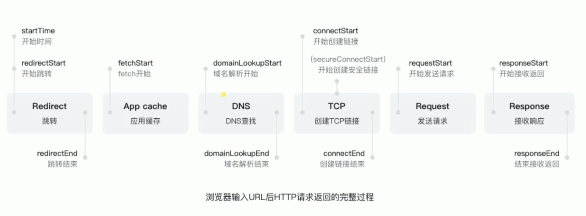

## 1.进程和线程

一个进程就是一个程序的运行实例。详细解释就是，启动一个程序的时候，操作系统会为该程序创建一块内存，用来存放代码、运行中的数据和一个执行任务的主线程，我们把这样的一个运行环境叫进程。

线程是不能单独存在的，它是由进程来启动和管理的。

线程是依附于进程的，而进程中使用多线程并行处理能提升运算效率。

1. 进程中的任意一线程执行出错，都会导致整个进程的崩溃。
2. 线程之间共享进程中的数据。
3. 当一个进程关闭之后，操作系统会回收进程所占用的内存。
4. 进程之间内容隔离

## 2.最新谷歌浏览器

最新的 Chrome 浏览器包括：1 个浏览器（Browser）主进程、1 个 GPU 进程、1 个网络（NetWork）进程、多个渲染进程和多个插件进程。

下面我们来逐个分析下这几个进程的功能。

- 浏览器进程。主要负责界面显示、用户交互、子进程管理，同时提供存储等功能。
- 渲染进程。核心任务是将 HTML、CSS 和 JavaScript 转换为用户可以与之交互的网页，排版引擎 Blink 和 JavaScript 引擎 V8 都是运行在该进程中，默认情况下，Chrome 会为每个 Tab 标签创建一个渲染进程。出于安全考虑，渲染进程都是运行在沙箱模式下。
- GPU 进程。其实，Chrome 刚开始发布的时候是没有 GPU 进程的。而 GPU 的使用初衷是为了实现 3D CSS 的效果，只是随后网页、Chrome 的 UI 界面都选择采用 GPU 来绘制，这使得 GPU 成为浏览器普遍的需求。最后，Chrome 在其多进程架构上也引入了 GPU 进程。
- 网络进程。主要负责页面的网络资源加载，之前是作为一个模块运行在浏览器进程里面的，直至最近才独立出来，成为一个单独的进程。
- 插件进程。主要是负责插件的运行，因插件易崩溃，所以需要通过插件进程来隔离，以保证插件进程崩溃不会对浏览器和页面造成影响。

## 3.浏览器端发起 HTTP 请求流程

HTTP 是一种允许浏览器向服务器获取资源的协议

### 1. 构建请求

```js
GET /index.html HTTP1.1
```

### 2. 查找缓存

在真正发起网络请求之前，浏览器会先在浏览器缓存中查询是否有要请求的文件。其中，浏览器缓存是一种在本地保存资源副本，以供下次请求时直接使用的技术。
当浏览器发现请求的资源已经在浏览器缓存中存有副本，它会拦截请求，返回该资源的副本，并直接结束请求，而不会再去源服务器重新下载。这样做的好处有：

缓解服务器端压力，提升性能（获取资源的耗时更短了）；
对于网站来说，缓存是实现快速资源加载的重要组成部分。
当然，如果缓存查找失败，就会进入网络请求过程了。

### 3. 准备 IP 地址和端口

浏览器会请求 DNS 返回域名对应的 IP，当然浏览器还提供了 DNS 数据缓存服务，如果某个域名已经解析过了，那么浏览器会缓存解析的结果，以供下次查询时直接使用，这样也会减少一次网络请求。

### 4. 等待 TCP 队列

现在已经把端口和 IP 地址都准备好了，那么下一步是不是可以建立 TCP 连接了呢？

答案依然是“不行”。Chrome 有个机制，同一个域名同时最多只能建立 6 个 TCP 连接，如果在同一个域名下同时有 10 个请求发生，那么其中 4 个请求会进入排队等待状态，直至进行中的请求完成。

当然，如果当前请求数量少于 6，会直接进入下一步，建立 TCP 连接。

### 5. 建立 TCP 连接

### 6. 发送 HTTP 请求

首先浏览器会向服务器发送请求行，它包括了请求方法、请求 URI（Uniform Resource Identifier）和 HTTP 版本协议。

### 7. 服务器端处理 HTTP 请求流程

1. 返回请求
   服务器会返回响应行，包括协议版本和状态码。

2. 断开连接
   通常情况下，一旦服务器向客户端返回了请求数据，它就要关闭 TCP 连接。
   如果返回头中含有

```js
Connection: Keep - Alive;
```

那么 TCP 连接在发送后将仍然保持打开状态，这样浏览器就可以继续通过同一个 TCP 连接发送请求。保持 TCP 连接可以省去下次请求时需要建立连接的时间，提升资源加载速度。比如，一个 Web 页面中内嵌的图片就都来自同一个 Web 站点，如果初始化了一个持久连接，你就可以复用该连接，以请求其他资源，而不需要重新再建立新的 TCP 连接。

3. 重定向

响应行返回的状态码是 301，状态 301 就是告诉浏览器，我需要重定向到另外一个网址，而需要重定向的网址正是包含在响应头的 Location 字段中

## 4.浏览器缓存

### DNS 缓存和页面资源缓存

1. DNS 缓存比较简单，它主要就是在浏览器本地把对应的 IP 和域名关联起来

2. 先从本地缓存中查找结果以及缓存标识，根据缓存标识判断是否使用本地缓存，如果缓存有效，则使用本地缓存，否则向服务器发请求并且携带缓存标识。根据是否向浏览器发
   器 Http 请求，将缓存过程分为两个部分 强缓存和协商缓存，强缓存优于协商缓存。

- **强缓存**，服务器通知浏览器一个缓存时间，在缓存时间内，下次请求直接用缓存，否则执行比较缓存策略。
- **协商缓存**，让客户端和服务器之间能实现缓存文件是否更新的验证，提升缓存的复用率，将缓存信息中的 `ETag` 和 `Last-Modified` 通过请求发送给服务器，由服务器校验，返回 304 状态码时，浏览器直接使用缓存。

HTTP 缓存都是从第二次请求开始的:

- 第一次请求资源时，服务器返回资源，在 `Response header` 中返回资源的缓存策略。
- 第二次请求时，浏览器判断这些请求参数，击中强缓存返回 200，否则把请求参数添加到 `Request header` 中传给服务器，看是否击中协商缓存，击中则返回 304，否则返回新的资源。

#### 强缓存

- 强缓存命中，在 network 中显示 from memory 或者 from disk。
- 控制强缓存的字段: `Cache-Control`(http1.1) 和 `Expires`(http1.0)。
- `Cache-Control` 是一个相对时间，表示上次正确请求的后多少秒的时间段内缓存有效。
- `Expires` 是一个绝对时间，表示在这个时间之前都从缓存里读数据，无需发请求。
- `Cache-Control` 优先于 `Expires`，前者是为了解决手动修改 `Expires` 导致缓存判断错误的问题，同时存在时使用 `Cache-Control`。

`Cache-Control` 常用的值为：

- `max-age`: 最大有效时间
- `must-revalidate`: 超过`max-age`的时间，浏览器必须向服务器发送请求，验证资源是否还有效。
- `no-cache`: 不使用强缓存，需要与服务器验证缓存是否新鲜。
- `no-store`: 真正意义的不使用缓存，所有内容都不走缓存，包括强制与对比。
- `public`: 所有内容都可以被缓存(包括客户端和代理服务器，如 CDN)
- `private`: 所用内容只有客户端可以缓存，代理服务器不能缓存。

- 到期

  - `max-age=<seconds\>`
    - 缓存到期时间
  - `s-maxage=<seconds\>`
    - 代理服务器专用
  - `5`
    - 指示客户机可以使用超出 max-age 时间的响应

  重新验证

  - must-revalidate
    - 设置了 max-age 的资源过期后必须到源服务端验证资源是否还可用
  - proxy-revalidate
    - （缓存服务器用）设置了 max-age 的资源过期后必须到源服务端验证资源是否还可用

#### 协商缓存

- 协商缓存的状态码由服务器决策返回 200 或者 304
- 浏览器设置不走强缓存或者强缓存失效，并且请求头中设置了`If-Modified-Since`或者`If-None-Match`时，会将这两个值带到服务器端去验证是否命中协商缓存，如果命中，返回 304，加载浏览器缓存，并且响应头会设置`Last-Modified`或者`ETag`属性
- `Last-Modified/If-Modified-Since`(http1.0)表示服务器的资源最后一次修改的时间
- `ETag/If-None-Match`(http1.1)表示服务器资源的唯一标识，只要资源变化，ETag 就会重新生成
- `ETag/If-None-Match`比`Last-Modified/If-Modified-Since`优先级高

- `Last-Modified/If-Modified-Since`

  - 服务器通过`Last-Modified`字段告知客户端资源最后一次被修改的时间，例如`Last-Modified: Mon, 10 Nov 2021 08:24:00 GMT`
  - 浏览器将这个值和内容一起记录在缓存数据库中。
  - 下一次请求相同资源时，浏览器从自己的缓存中找出不确实是否过期的缓存，因此请求头中将上次的`Last-Modified`值写入到`If-Modified-Since`字段。
  - 服务器会将`If-Modified-Since`的值与`Last-Modified`字段进行对比，如果相等，表示未修改，返回 304，否则返回 200，返回新数据
  - 优点
    - 不存在版本问题，每次请求都会去服务器校验
  - 缺点
    - 只要资源修改，无论是否发生实质性的变化，都会将该资源返回给客户端，例如周期性重写
    - 因为以时刻作为标识，最小单位是秒，无法判断一秒内多次修改的情况，
    - 某些服务器不能精确得到文件最后的修改时间
    - 如果文件是通过服务器动态生成的，那么该方法的更新永远是生成的时间，尽管文件可能没有变化，所以起不到缓存作用。

- `ETag/If-None-Match`
  - `ETag`存储的是文件的特殊标识(一般都是 hash 生成的)，其余与 Last-Modified 一致，只不过把时间改为了`ETag`以及他表示的文件的 hash
  - `ETag`优先级高于`Last-Modified`
  - 优点
    - 可以更精确的判断资源是否被修改，可以识别一秒内的多次修改
    - 不存在版本问题，每次请求都会去服务器校验
  - 缺点
    - 计算`ETag`值消耗性能
    - 分布式服务器存储的情况下，计算的`ETag`的算法如果不一样，会导致浏览球从一台服务器上获得页面内容后到另外一台服务器进行验证时不匹配

## 5.从输入 URL 到页面加载完成的过程

[参考链接](https://segmentfault.com/a/1190000006879700)



- 判断是否需要跳转(301)
- 从浏览器中读取缓存
- DNS 解析
- TCP 连接
- HTTP 请求发出
- 服务端处理请求，HTTP 响应返回
- 浏览器拿到响应数据，解析响应内内容，把解析结果展示给用户

1. 在浏览器地址栏输入 URL
2. 浏览器查看是否有**强缓存**，如果请求资源在缓存中并且新鲜，跳转到转码步骤
   1. 如果资源未缓存，发起新请求
   2. 如果已缓存，检验是否足够新鲜，足够新鲜直接提供给客户端，否则与服务器进行验证。
   3. 检验新鲜通常有两个 HTTP 头进行控制`Expires`和`Cache-Control`：
      - HTTP1.0 提供 Expires，值为一个绝对时间表示缓存新鲜日期
      - HTTP1.1 增加了 Cache-Control: max-age=,值为以秒为单位的最大新鲜时间
3. 浏览器**解析 URL**获取协议，主机，端口，path
4. 浏览器**组装一个 HTTP（GET）请求报文**
5. **DNS 解析**，查找过程如下：
   1. 浏览器缓存
   2. 本机缓存
   3. hosts 文件
   4. 路由器缓存
   5. ISP DNS 缓存
   6. DNS 查询（递归查询 / 迭代查询）
6. **端口建立 TCP 链接**，三次握手如下：
   1. 客户端发送一个 TCP 的**SYN=1，Seq=X**的包到服务器端口
   2. 服务器发回**SYN=1， ACK=X+1， Seq=Y**的响应包
   3. 客户端发送**ACK=Y+1， Seq=Z**
7. TCP 链接建立后**发送 HTTP 请求**
8. 服务器接受请求并解析，将请求转发到服务程序，如虚拟主机使用 HTTP Host 头部判断请求的服务程序
9. 服务器检查**HTTP 请求头是否包含缓存验证信息**如果验证缓存新鲜，返回**304**等对应状态码
10. 处理程序读取完整请求并准备 HTTP 响应，可能需要查询数据库等操作
11. 服务器将**响应报文通过 TCP 连接发送回浏览器**
12. 浏览器接收 HTTP 响应，然后根据情况选择**关闭 TCP 连接或者保留重用，关闭 TCP 连接的四次握手如下**：
    1. 主动方发送**Fin=1， Ack=Z， Seq= X**报文
    2. 被动方发送**ACK=X+1， Seq=Z**报文
    3. 被动方发送**Fin=1， ACK=X， Seq=Y**报文
    4. 主动方发送**ACK=Y， Seq=X**报文
13. 浏览器检查响应状态吗：是否为 1XX，3XX， 4XX， 5XX，这些情况处理与 2XX 不同
14. 如果资源可缓存，**进行缓存**
15. 对响应进行**解码**（例如 gzip 压缩）
16. 根据资源类型决定如何处理（假设资源为 HTML 文档）
17. **解析 HTML 文档，构件 DOM 树，下载资源，构造 CSSOM 树，执行 js 脚本**，这些操作没有严格的先后顺序，以下分别解释
18. **构建 DOM 树**：
    1. **Tokenizing**：根据 HTML 规范将字符流解析为标记
    2. **Lexing**：词法分析将标记转换为对象并定义属性和规则
    3. **DOM construction**：根据 HTML 标记关系将对象组成 DOM 树
19. 解析过程中遇到图片、样式表、js 文件，**启动下载**
20. 构建**CSSOM 树**：
    1. **Tokenizing**：字符流转换为标记流
    2. **Node**：根据标记创建节点
    3. **CSSOM**：节点创建 CSSOM 树
21. **[根据 DOM 树和 CSSOM 树构建渲染树](https://developers.google.com/web/fundamentals/performance/critical-rendering-path/render-tree-construction)**:
    1. 从 DOM 树的根节点遍历所有**可见节点**，不可见节点包括：1）`script`,`meta`这样本身不可见的标签。2)被 css 隐藏的节点，如`display: none`
    2. 对每一个可见节点，找到恰当的 CSSOM 规则并应用
    3. 发布可视节点的内容和计算样式
22. **js 解析如下**：
    1. 浏览器创建 Document 对象并解析 HTML，将解析到的元素和文本节点添加到文档中，此时**document.readystate 为 loading**
    2. HTML 解析器遇到**没有 async 和 defer 的 script 时**，将他们添加到文档中，然后执行行内或外部脚本。这些脚本会同步执行，并且在脚本下载和执行时解析器会暂停。这样就可以用 document.write()把文本插入到输入流中。**同步脚本经常简单定义函数和注册事件处理程序，他们可以遍历和操作 script 和他们之前的文档内容**
    3. 当解析器遇到设置了**async**属性的 script 时，开始下载脚本并继续解析文档。脚本会在它**下载完成后尽快执行**，但是**解析器不会停下来等它下载**。异步脚本**禁止使用 document.write()**，它们可以访问自己 script 和之前的文档元素
    4. 当文档完成解析，document.readState 变成 interactive
    5. 所有**defer**脚本会**按照在文档出现的顺序执行**，延迟脚本**能访问完整文档树**，禁止使用 document.write()
    6. 浏览器**在 Document 对象上触发 DOMContentLoaded 事件**
    7. 此时文档完全解析完成，浏览器可能还在等待如图片等内容加载，等这些**内容完成载入并且所有异步脚本完成载入和执行**，document.readState 变为 complete,window 触发 load 事件
23. **显示页面**（HTML 解析过程中会逐步显示页面）
