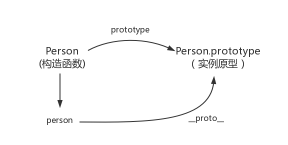
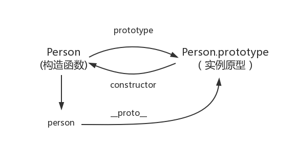
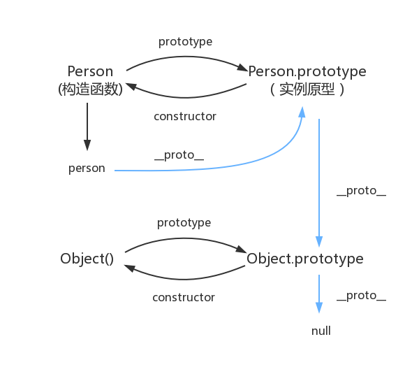

## 面试题

```js
Function.prototype.a = () => {
  console.log(1)
}
Object.prototype.b = () => {
  console.log(2)
}
function A = {};
const a = new A();
a.a();
a.b();

```

## 1.prototype

每一个函数都有一个 prototype 属性，这个属性指向函数的原型对象


```js
function Person() {}
Person.prototype.name = "songyuhang";

const person1 = new Person();
const person2 = new Person();
console.log(person1.name); // songyuhang
console.log(person2.name); // songyuhang
```

## 2. \_\_proto\_\_

这是每个对象(除 null 外)都会有的属性，叫做**proto**，这个属性会指向该对象的原型。

绝大部分浏览器都支持这个非标准的方法访问原型，然而它并不存在于 Person.prototype 中，实际上，它是来自于 Object.prototype ，与其说是一个属性，不如说是一个 getter/setter，当使用 obj.\_\_proto\_\_ 时，可以理解成返回了 Object.getPrototypeOf(obj)。



```js
function Person() {}
const person = new Person();

person.__proto__ === Person.prototype; // true
```

## 3.constructor

每一个原型都有一个 constructor 属性，这个属性指向关联的构造函数



```js
function Person() {}
Person.prototype.constructor === Person; // true
```

补充：

```js
function Person() {}
const person = new Person();
person.constructor === Person; // true
```

当获取 person.constructor 时，其实 person 中并没有 constructor 属性,当不能读取到 constructor 属性时，会从 person 的原型也就是 Person.prototype 中读取，正好原型中有该属性，所以：

```js
person.constructor === Person.prototype.constructor;
```

## 4.原型的原型

原型也是一个对象，既然是对象，用最原始的方式创建它：

```js
const obj = new Object();
obj.name = "songyuhang";
console.log(obj.name);
```

其实原型对象就是通过 Object 构造函数生成的，结合之前所讲，实例的 \_\_proto\_\_ 指向构造函数的 prototype


## 5.原型链

构造函数、原型和实例的关系：每个构造函数都有一个原型对象，原型对象都包含一个指向构造函数的指针，而实例都包含一个指向原型对象的内部指针。那么假如我们让原型对象等于另一个类型的实例，结果会怎样？显然，此时的原型对象将包含一个指向另一个原型的指针，相应地，另一个原型中也包含着一个指向另一个构造函数的指针。假如另一个原型又是另一个类型的实例，那么上述关系依然成立。如此层层递进，就构成了实例与原型的链条。这就是所谓的原型链的基本概念


