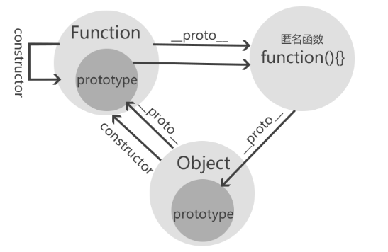

## 基本概念

简单说明下 prototype、\_\_proto\_\_ 和 constructor

### prototype

> object that provides shared properties for other objects

ECMAScript 对 prototype 的定义为是给其它对象提供共享属性的对象。而任何函数在创建的时候，都会默认给该函数添加 prototype 属性

### \_\_proto\_\_

ECMAScript 对 prototype 的定义是一个隐式引用。但之前的一些浏览器（火狐？），已经私自实现了 \_\_proto** 这个属性，使得可以通过 obj.\_\_proto** 这个显式的属性访问，访问到被定义为隐式属性的 prototype。  
其实正确的访问、设置方法应该是使用以下两个方法：

- Object.getPrototypeOf(obj) => 间接访问指定对象的 prototype 对象
- Object.setPrototypeOf(obj, anotherObj) => 间接设置指定对象的 prototype 对象

#### 注意

控制台中显示的 \_\_proto** 只是为了方便查看原型渲染出来的虚拟节点，实际上是不存在的。  
访问 obj.\_\_proto** 实际上走的是 Object.prototype 对象上 \_\_proto\_\_ 属性的 get/set 方法

```javascript
Object.defineProperty(Object.prototype, "__proto__", {
  get() {
    console.log("get");
  }
});
let test = {};
test.__proto__; // get
```

### constructor

constructor 属性返回的是对创建此对象的函数的引用。

#### 注意

1. 对于不同数据类型，constructor 的读写属性是不一样的
   - 引用类型 constructor 可读写
   - 基本类型 constructor 只读
   - null 和 undefined 没有 constructor 属性
2. 每一个对象都有其对应的构造函数，来自于其本身或者继承而来

:::tip
**proto**和 constructor 是对象独有的，而 prototype 属性是函数独有的，但是由于在 js 中函数也是对象，所以函数也有前两个属性
:::

### 小结

来个图大致看看三个属性之间的关系


通过上面这个图，大体可以得到一个关系式：  
<code>函数创建的对象.\_\_proto** === 该函数.prototype，该函数.prototype.constructor===该函数本身</code>  
但是有一个特例，对于 Function 而言，它是自己的构造函数，所以 <code>Function.prototype === Function.\_\_proto**</code>

## 原型链

> a prototype may have a non-null implicit reference to its prototype, and so on; this is called the prototype chain.

每个对象拥有一个原型对象，通过 \_\_proto** 指针指向上一个原型 ，并从中继承方法和属性，同时原型对象也可能拥有原型，这样一层一层，最终指向 null，这类关系就是原型链。实例 p 能通过 p.constructor 获取到值，就是原型链起到的作用，对于对象中没有的属性方法会沿着原型链去查找。而原型链是有终点的：<code>Object.prototype.\_\_proto**</code>，值为 null

### 扯一下 instanceof

instanceof 通常用于检查某个对象是不是另一个对象的实例  
用法：  
p instanceof Person  
实现原理：

```javascript
function myInstanceof(L, R) {
  let LPrototype = L.__proto__, //表达式左边的原型
    RPrototype = R.prototype; // 表达式右边的原型
  while (true) {
    if (LPrototype === null) {
      return false;
    }
    if (LPrototype == RPrototype) {
      return true;
    }
    LPrototype = LPrototype.__proto__;
  }
}
```

#### 为什么 Function 和 Object instanceof 都等于 true



用代码解释一下图片的现象：

```javascript
//①构造器Function的构造器是它自身
Function.constructor === Function; //true
//②*构造器Object的构造器是Function（由此可知所有构造器的constructor都指向Function）
Object.constructor === Function; //true
//③构造器Function的__proto__是一个特殊的匿名函数function() {}
console.log(Function.__proto__); //function() {}
//④这个特殊的匿名函数的__proto__指向Object的prototype原型。
Function.__proto__ === Object.__proto__; //true
//⑤Object的__proto__指向Function的prototype，也就是上面③中所述的特殊匿名函数
Object.__proto__ === Function.prototype; //true
Function.prototype === Function.__proto__; //true
```

### new 的过程中做了什么

1. 新生成一个空对象
2. 将空对象链接到原型中
3. 绑定 this
4. 返回新对象，如果构造函数没有显示的返回对象，就返回新创建的对象

#### 手写 new

```javascript
function create() {
  let obj = new Object(), // 新建一个空对象
    Constructor = [].shift.call(arguments); // 取得外部传入的构造器
  Object.setPrototypeOf(obj, Constructor.prototype); // 将空对象链接到原型中
  let res = Constructor.apply(obj, arguments); // 借用外部传入的构造器给obj设置属性
  return res instanceof Object ? res : obj; // 考虑构造函数有返回值的情况
}
```

## 各类继承方式

基本原理：利用原型让一个引用类型继承另一个引用类型的属性和方法

### 类式继承

```javascript
function SuperClass() {
  this.superValue = true;
}
SuperClass.prototype.getSuperValue = function() {
  return this.superValue;
};

function SubClass() {
  this.subValue = false;
}
SubClass.prototype = new SuperClass();

SubClass.prototype.getSubValue = function() {
  return this.subValue;
};

var instance = new SubClass();
```

#### 注意

- 由于子类通过其原型 prototype 对父类实例化，继承了父类，所以说父类中如果共有属性是引用类型，就会在子类中被所有的实例所共享，因此一个子类的实例更改子类原型从父类构造函数中继承的共有属性就会直接影响到其他的子类
- 由于子类实现的继承是靠其原型 prototype 对父类进行实例化实现的，因此在创建父类的时候，是无法向父类传递参数的。因而在实例化父类的时候也无法对父类构造函数内的属性进行初始化

### 构造函数继承

```javascript
function SuperClass(id) {
  this.books = ["js", "css"];
  this.id = id;
}
SuperClass.prototype.showBooks = function() {
  console.log(this.books);
};
function SubClass(id) {
  //继承父类
  SuperClass.call(this, id);
}
//创建第一个子类实例
var instance1 = new SubClass(10);
//创建第二个子类实例
var instance2 = new SubClass(11);

instance1.books.push("html");
console.log(instance1);
console.log(instance2);
instance1.showBooks(); //TypeError
```

通过<code>SuperClass.call(this,id)</code>语句实现了继承，由于父类中给 this 绑定属性，因此子类自然也就继承父类的共有属性。这种继承方式由于没有涉及到 prototype，所以避免了类式继承的第一个问题。

#### 注意

- 由于构造函数继承没有涉及到 prototype，所以父类的原型方法自然不会被子类继承，除非把方法写到构造函数里面。但是这样会导致每个实例都会单独拥有一个方法，没办法复用

### 组合式继承

```javascript
function SuperClass(name) {
  this.name = name;
  this.books = ["Js", "CSS"];
}
SuperClass.prototype.getBooks = function() {
  console.log(this.books);
};
function SubClass(name, time) {
  SuperClass.call(this, name);
  this.time = time;
}
SubClass.prototype = new SuperClass();

SubClass.prototype.getTime = function() {
  console.log(this.time);
};
```

#### 注意

- 构造函数调用了两次

### 原型式继承

```javascript
function inheritObject(o) {
  function F() {}
  Object.setPrototypeOf(F, o);
  return new F();
}
```

其实 Object.create 就是对上面这个写法的规范化，如果只考虑参入一个参数的情况的话，上面的代码就可以实现和 Object.create 类似的功能。

#### 注意

- 和类似继承一样，对于引用类型的变量，还是存在子类实例共享的情况

:::tip
Object.create 接受的参数：

- 新创建对象的原型对象。如果接受的对象是 null，会生成一个不继承任何属性的对象
- 默认为 undefinded，包含对象的属性描述符以及相应的属性名称的对象。对应 Object.defineProperties()的第二个参数。
  :::

### 寄生式继承

```javascript
var book = {
  name: "js book",
  likeBook: ["html book", "css book"]
};
function createBook(obj) {
  //通过原型方式创建新的对象
  var o = new inheritObject(obj);
  // 拓展新对象
  o.getName = function(name) {
    console.log(name);
  };
  // 返回拓展后的新对象
  return o;
}
```

在原型式继承的基础上，进行了拓展，可以在父类的基础上添加属性和方法

### 寄生组合式继承

```javascript
function inheritPrototype(subClass, superClass) {
  // 复制一份父类的原型副本到变量中
  var p = inheritObject(superClass.prototype);
  // 修正因为重写子类的原型导致子类的constructor属性被修改
  p.constructor = subClass;
  // 设置子类原型
  subClass.prototype = p;
}

function SuperClass(name) {
  this.name = name;
  this.books = ["js book", "css book"];
}
SuperClass.prototype.getName = function() {
  console.log(this.name);
};
function SubClass(name, time) {
  SuperClass.call(this, name);
  this.time = time;
}
inheritPrototype(SubClass, SuperClass);
SubClass.prototype.getTime = function() {
  console.log(this.time);
};
var instance = new SubClass("Js", "2018/22/33");
```

在构造函数继承中，已经调用了父类的构造函数。所以这个时候需要的就是父类的原型对象的一个副本，进而达到继承父类方法的目的，但是直接赋值给子类的话会导致 constructor 的指向不是子类对象，所以还要手动改一下 constructor 属性的指向。

:::warning

- 子类使用对象字面量创建原型方法时，会重写原型链，导致和父类没有关系。所以添加原型方法的时候，要用<code>subType.prototype</code>的方式
- 给原型添加方法的代码一定要放在替换原型的语句之后，也就是在<code>subType.protype = new superType()</code>之后，不然就被覆盖了
  :::

## 参考

[深入理解 JavaScript 原型](https://mp.weixin.qq.com/s/1UDILezroK5wrcK-Z5bHOg)  
[【THE LAST TIME】一文吃透所有 JS 原型相关知识点](https://juejin.im/post/6844903984335945736)
