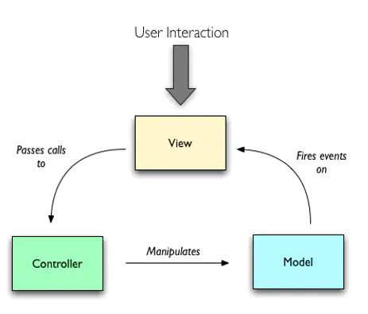
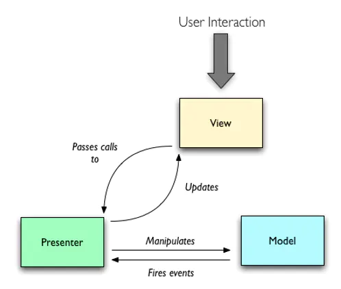
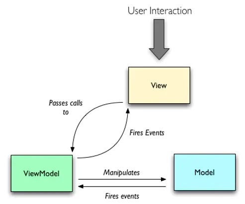
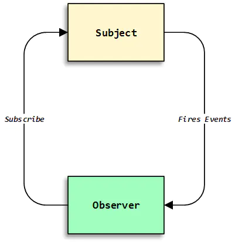
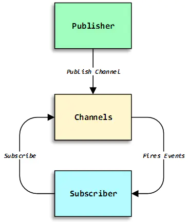

---
title: 手写简易MVVM框架
author: zhangyijie
date: 2021-03-31
tags:
  - 分享
---  

## MV\*设计模式的演变历史

### MVC（Model-View-Controller）



如图所示，MVC 简单地将图形用户界面分为 3 个部分：

- View
  - 检测用户的键盘、鼠标等行为，传递调用 Controller 执行应用逻辑。View 更新需要重新获取 Model 的数据
- Controller
  - View 和 Model 之间协作的应用逻辑或业务逻辑处理
- Model
  - Model 变更后，通过**观察者模式**通知 View 更新视图

#### 优缺点

- 优点

  - 职责分离：模块化程度高、Controller 可替换、可复用性、可扩展性强
  - 多视图更新：使用**观察者模式**可以做到单 Model 通知多视图实现数据更新

- 缺点

  - 测试困难：View 需要 UI 环境，因此依赖 View 的 Controller 测试相对比较困难
  - 依赖强烈：View 强依赖 Model(特定业务场景)，因此 View 无法组件化设计

### MVP



如图所示，MVP 和 MVC 相比，最明显的改变就是打破了 View 对于 Model 的依赖

- View：View 不再处理同步逻辑，对 Presenter 提供接口调用。由于不再依赖 Model，可以让 View 从特定的业务场景中抽离，完全可以做到组件化
- Presenter：和经典 MVC 的 Controller 相比，任务更加繁重，不仅要处理应用业务逻辑，还要处理同步逻辑
- Model：Model 变更后，通过**观察者模式**通知 Presenter，如果有视图更新，Presenter 又可能调用 View 的接口更新视图

#### 优缺点

- 优点

  - View 可组件化设计
  - Presenter 便于测试

- 缺点
  - Presenter 逻辑多、维护困难

### MVVM



MVVM 在 MVP 的基础上进行优化，将 Presenter 改良成 ViewModel

- Passive View：可组件化，View 的变化会通过 Binder 自动更新相应的 Model
- Model：Model 变更后，通过**观察者模式**通知 Binder，一旦监听到变化，Binder 就会自动实现视图的更新
- ViewModel：内部集成了 Binder(Data-binding Engine，数据绑定引擎)，在 MVP 中派发器 View 或 Model 的更新都需要通过 Presenter 手动设置，而 Binder 则会实现 View 和 Model 的双向绑定，从而实现 View 或 Model 的自动更新

#### 优缺点

- 优点

  - 提升了可维护性，解决了 MVP 大量的手动同步的问题，提供双向绑定机制
  - 简化了测试，同步逻辑是交由 Binder 处理，View 跟着 Model 同时变更，所以只需要保证 Model 的正确性，View 就正确

- 缺点
  - 产生性能问题，对于简单的应用会造成额外的性能消耗。
  - 对于复杂的应用，视图状态较多，视图状态的维护成本增加，ViewModel 构建和维护成本高。

### 观察者模式和发布/订阅模式



- 观察者模式

  - 模式里面只有两个角色，被观察者和观察者
  - 目标对象和观察者对象必须合作才能维持约束
  - 观察者对象向订阅它们的对象发布其感兴趣的事件
  - 通信只能是单向的



- 发布/订阅模式
  - 模式里面除了订阅者和发布者还有信息调度中心
  - 订阅者和发布者彼此不关联，借助信息调度中心进行沟通
  - 单一目标通常有很多订阅者，有时一个发布对象的观察者是另一个观察者的发布对象
  - 通信可以实现双向

#### 两者的区别

在耦合性上，前者的观察者和被观察者，是松耦合的关系。而后者的发布者和订阅者，则完全不存在耦合

### 手写简易的 MVVM

思路：

1. 所有传入参数挂载在\$options 上，新建 data 和\_data
2. 数据劫持：用 Object.defineProperty 拦截数据修改和获取
3. 数据代理：实现用 mvvm.a.b 的方式获取数据
4. 数据编译：编写 compile 和 replaceTxt 方法，实现视图的更新
5. 数据更新视图：编写 Watch 和 Dep，实现数据修改时，更新视图
6. 双向数据绑定：实现 input 的数据修改时，更新数据和视图

```javascript
<!DOCTYPE html>
<html lang="en">

<head>
  <meta charset="UTF-8">
  <meta http-equiv="X-UA-Compatible" content="IE=edge">
  <meta name="viewport" content="width=device-width, initial-scale=1.0">
  <title>简易实现MVVM框架</title>
</head>

<body>
  <div id="app">
    <input type="text" v-model="info.age" placeholder="请输入年龄" />
    <div>类型：{{type}}</div>
    <div>{{info.age}}</div>
  </div>
</body>
<script>

  function Vue(options) {
    const { el, data } = options;
    this.$options = options;
    this.$el = document.querySelector(el);
    this.$data = this._data = data;
    observe(this.$data)
    for (const key in this._data) {
      Object.defineProperty(this, key, {
        get: () => {
          return this._data[key]
        },
        set: (newVal) => {
          this._data[key] = newVal
        }
      })
    }
    compile(this)
  }

  function observe(data) {
    if(typeof data !== 'object' || !data) return;
    for(const key in data) {
      let val = data[key],
        dep = new Dep();
        observe(val)
      Object.defineProperty(data,key,{
        get:() => {
          Dep.target && dep.addSub(Dep.target)
          return val
        },
        set:(newVal) => {
          if(val === newVal) return;
          val = newVal;
          observe(val)
          dep.notify();
        }
      })
    }
  }

  function compile({$el,$data}) {
    const fragment = document.createDocumentFragment()
    while((child = $el.firstChild)) {
      fragment.append(child)
    }
    replaceTxt(fragment,$data)
    $el.append(fragment)
  }

  function replaceTxt(el,data) {
    el.childNodes.forEach(node => {
      const {nodeType, attributes,childNodes,textContent} = node,
        reg= /\{\{(.*)\}\}/g;
      if(nodeType === 3 && reg.test(textContent)) {
        node.textContent = textContent.replace(reg, (content, key) => {
          const keyArr = key.split(".");
          let val = data;
          keyArr.forEach(item => val = val[item])
          new Watcher(data, key, function (newVal){
            node.textContent = textContent.replace(reg, newVal).trim();
          })
          return val
        })
      }
      if (nodeType == 1) {
        [...attributes].forEach(({ name, value:key }) => {
          if(name === 'v-model') {
            const keyArr = key.split("."),
              length = keyArr.length;
            let val = copy = data;
            keyArr.forEach((item,index) => {
              if(length != 1 && index < length -1) {
                copy = copy[item]
              }
              val = val[item]
            })
            new Watcher(data,key, function (newVal) {
              node.value = newVal;
            })
            node.value = val;
            node.addEventListener('input',(e) => {
              length != 0
                ? (copy[keyArr[length - 1]] = e.target.value)
                : (data[key] = e.target.value);
            })
          }
        })
      }
      if(childNodes?.length) {
        replaceTxt(node, data)
      }
    })
  }

  function Dep() {
    this.subs = [];
  }

  Dep.prototype.addSub = function(sub) {
    this.subs.push(sub);
  }

  Dep.prototype.notify = function() {
    this.subs.forEach(sub => sub.update());
  }

  function Watcher(data, key, fn) {
    this.data = data;
    this.key = key;
    this.fn = fn;
    Dep.target = this;
    const keyArr = key.split(".");
    let val = data;
    keyArr.forEach(item => val = val[item])
    Dep.target = null;
  }

  Watcher.prototype.update = function () {
    const keyArr = this.key.split(".");
    let val = this.data;
    keyArr.forEach(key => {
      val = val[key];
    });
    this.fn(val)
  }

  let mvvm = new Vue({
    el: "#app",
    data: {
      type: "asd",
      info: {
        age: "23"
      }
    }
  });

</script>

</html>
```

> 原文：[基于 Vue 实现一个简易 MVVM](https://juejin.cn/post/6844904099704471559)
