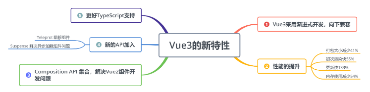

### Vue3.x 让人惊艳的一些新特性：


### Vue3.x 新方法
1、setup()、ref() 函数

setup()： 可以代替 Vue2 中的 date 和 methods 属性  
     ref()： 要在template中使用的变量，必须用ref包装一下  
   return：return出去的数据和方法，在模板中才可以使用，这样可以精准的控制暴露的变量和方法  
1.1 在 template 上展示 books

```vue
<template>
  <div class="home">
    <div>我的书架:
      <div class="my-book" v-for="(item, idx) in books" :key="idx">{{ item }}</div>
    </div>
  </div>
</template>

<script lang="ts">
import { defineComponent, ref } from "vue";

export default defineComponent({
  name: "Home",
  setup() {
    const books = ref(["星辰变", "盘龙", "斗破苍穹"]);
    return {
      books,
    };
  },
});
</script>
```
1.2 在 template 上选择一本小说
```vue
<template>
  <div class="home">
    <div>
      我的书架:
      <div class="my-book" v-for="(item, idx) in books" :key="idx">
        {{ item }}
      </div>
    </div>
    <div>
      <button @click="selectBookFun">选择一本小说：</button>
      {{ selectBook }}
    </div>
  </div>
</template>
<script lang="ts">
import { defineComponent, ref } from "vue";

export default defineComponent({
  name: "Home",
  setup() {
    const books = ref(["星辰变", "盘龙", "斗破苍穹"]);
    const selectBook = ref("");
    const selectBookFun = () => {
      let ranNum = Math.floor(Math.random() * 3);
      selectBook.value = books.value[ranNum];
    };
    return {
      books,
      selectBook,
      selectBookFun,
    };
  },
});
</script>
```
2、reactive()、toRefs() 函数  
reactive()： 返回一个对象  
  toRefs()： 将普通变量转化成响应式变量  
```vue
<template>
  <div class="home">
    <div>
      我的书架:
      <div class="my-book" v-for="(item, idx) in books" :key="idx">
        {{ item }}
      </div>
    </div>
    <div>
      <button @click="selectBookFun">选择一本小说：</button>
      {{ selectBook }}
    </div>
  </div>
</template>
<script lang="ts">
import { defineComponent, reactive, toRefs } from "vue";

export default defineComponent({
  name: "About",
  setup() {
    const data = reactive({
      books: ["星辰变", "盘龙", "斗破苍穹"],
      selectBook: "",
      selectBookFun: () => {
        let ranNum = Math.floor(Math.random() * 3);
        data.selectBook = data.books[ranNum];
      },
    });
    const refData = toRefs(data);
    return {
      ...refData,
    };
  },
});
</script>
```
3、Vue3.x 钩子函数
3.1 Vue2.x 和 Vue3.x 对比  

Vue2.x------------------------Vue3.x  
beforeCreate        -------> setup()  
created                 -------> setup()  
beforeMount         -------> onBeforeMount  
mounted               -------> onMounted  
beforeUpdate       -------> onBeforeUpdate  
updated                -------> onUpdated  
beforeDestroy      -------> onBeforeUnmount  
destroyed            -------> onUnmounted  
activated             -------> onActivated  
deactivated         -------> onDeactivated  
errorCaptured     -------> onErrorCaptured      在Vue3.x 内Vue2.x的钩子函数也可以使用，Vue3.x的钩子函数执行比Vue2.x的快！  

3.2 Vue3.x 新增钩子函数  
onRenderTracked: 状态跟踪  
     会跟踪页面上所有响应式变量和方法的状态，也就是我们用return返回去的值。只要页面有update的情况，他就会跟踪，然后生成一个event对象，我们通过event对象来查找程序的问题所在  
onRenderTriggered: 状态触发  
     不会跟踪每一个值，而是给你变化值的信息，并且新值和旧值都会给你明确的展示出来  
```vue
<script lang="ts">
event变量详解：
- key 那边变量发生了变化
- newValue 更新后变量的值
- oldValue 更新前变量的值
- target 目前页面中的响应变量和函数

// 对应代码
import {
  defineComponent,
  reactive,
  toRefs,
  onRenderTracked,
  onRenderTriggered,
} from "vue";

export default defineComponent({
  name: "About",
  setup() {
    const data = reactive({
      books: ["星辰变", "盘龙", "斗破苍穹"],
      selectBook: "",
      selectBookFun: () => {
        let ranNum = Math.floor(Math.random() * 3);
        data.selectBook = data.books[ranNum];
      },
    });
    onRenderTracked((event) => {
      console.log(event);
    });
    onRenderTriggered((event) => {
      console.log("onRenderTriggered:");
      console.log(event);
    });
    const refData = toRefs(data);
    return {
      ...refData,
    };
  },
});
</script>
```

> 参考：[vue2中Options API 和 vue3中Composition API 的对比](https://blog.csdn.net/fesfsefgs/article/details/106572929)  
> 参考：[Vue3.x+TypeScript 基础课程-2020 年新版](https://jspang.com/detailed?id=64)