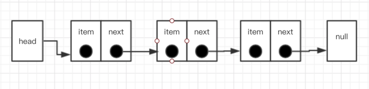

## 1.栈和队列

- 栈，先进后出
- 队列，先进先出

相关题目:

- [剑指 offer09.用两个栈实现队列](https://leetcode-cn.com/problems/yong-liang-ge-zhan-shi-xian-dui-lie-lcof/)

  - [题解](./S001_剑指offer09用两个栈实现队列.html)

- [剑指 offer30 包含 min 函数的栈](https://leetcode-cn.com/problems/bao-han-minhan-shu-de-zhan-lcof/)
  - [题解](./S002_剑指offer30包含min的栈.html)

## 2.链表

链表有单向链表、双向链表和循环链表

链表存储的是有序的元素集合，和数组不同的是，链表中的元素在内存并不是连续放置，每个元素由一个存储元素本身的节点和一个指向下一个元素的引用组成，结构如下图所示：

和数组相比，链表的优势在于：添加或者删除元素不需要移动其他元素,劣势在与链表相对于数组结构更复杂，需要一个指向下一个元素的指针，在访问链表中的某个元素也需要从头迭代，而不是像数组一样直接访问

- [剑指 Offer06. 从尾到头打印链表](https://leetcode-cn.com/problems/cong-wei-dao-tou-da-yin-lian-biao-lcof/)

  - [题解](./S003_剑指offer06从尾到头输出链表.html)

- [剑指 Offer24. 反转链表](https://leetcode-cn.com/problems/fan-zhuan-lian-biao-lcof/)
  - [题解](./S004_剑指offer24反转链表.html)
